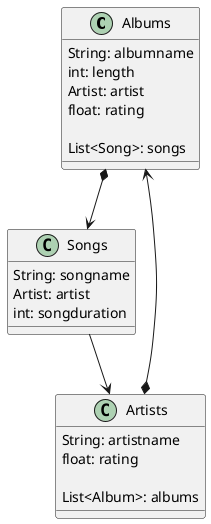

# DBI MongoDB Projekt

Ignore the most of the project if you are only interested in seeing the MongoDB Part. Look into albumrating-service to inspect the Mongodb related code.
## DB Model

## Domain 

Um für jedes Document eine MongoDB Id zu generieren lassen wir jede Klasse von einer Persistable Klasse ableiten, welche eine Id zu verfügung stellt. Diese Id wird von JPA 
und dem MongoRepository in eine ObjectId gemappt.
```java
@Document(collection = "database_sequences")
@NoArgsConstructor(access = AccessLevel.PUBLIC)
public class Persistable {

    @Id
    @Getter
    private String id;

    @Override
    public boolean equals(Object o) {
        if (this == o) return true;
        if (o == null || getClass() != o.getClass()) return false;
        Persistable that = (Persistable) o;
        return Objects.equals(id, that.id);
    }

    @Override
    public int hashCode() {
        return Objects.hash(id);
    }
}
```

Die Domain Klassen schauen dann so aus:
```java
@Document("albums")
@Data
@Builder
public class Album extends Persistable {


    private String albumName;
    private int length;
    private Artist artist;
    private float rating;


    private List<Song> songs;
}


@Document("artists")
@Data
@Builder
public class Artist extends Persistable{


    private String artistName;

    @Nullable
    private float rating;

    @Nullable
    private List<Album> albums;
}


@Document("songs")
@Data
@Builder
public class Song extends Persistable{


    private String songTitle;
    private Artist artist;
    private int songduration;

}
```

## Repository Implementation
Spring Mongo Data JPA bietet ein eigenes MongoRepository an, welches hier natürlich verwendet wurde. Zusätzlich können eigene Queries erstellt werden, anhand von simplen 
Methdodennamen.
```java
@Repository
public interface AlbumRepository extends MongoRepository<Album, String> {

    Album findAlbumByAlbumName(String albumname);

    void deleteAlbumByAlbumName(String albumname);
    
}
```

## Mongo Configuration
Bevor wir auf die Datenbank zugreifen können müssen wir paar Dinge konfigurieren. Dafür schreiben wir eine MongoConfig Klasse und durch das @Configuration Bean 
beachtet Spring dies.
```java
@Configuration
public class MongoConfig extends AbstractMongoClientConfiguration {

    @Override
    protected String getDatabaseName() {
        return "albummanager";
    }

    @Override @Bean
    public MongoClient mongoClient() {
        ConnectionString connectionString = new ConnectionString("mongodb://localhost:27017/albummanager");
        MongoClientSettings mongoClientSettings = MongoClientSettings.builder()
                .applyConnectionString(connectionString)
                .build();

        return MongoClients.create(mongoClientSettings);
    }

    @Override
    public Collection getMappingBasePackages() {
        return Collections.singleton("at.spengergasse.albummanger");
    }
}
```
## Fake Data
Für das Testen werden Fake Daten gebraucht. Die JavaFaker Library erlaubt uns das. Zusätzlich verwenden wir das MongoTemplate 
Objekt, welches diverse Operationen auf die Datenbank ausführen kann, um die Collections zu erstellen.
```java 
@Autowired
    private MongoTemplate mongoTemplate;

    private final Faker faker = new Faker();

    private List<Song> songs;
    private List<Album> albums;
    private List<Artist> artists;

    @BeforeAll
    public void initDB(){
        //mongoDBContainer.start();

        mongoTemplate.dropCollection("songs");
        mongoTemplate.dropCollection("albums");
        mongoTemplate.dropCollection("artists");
        mongoTemplate.createCollection("artists");
        mongoTemplate.createCollection("albums");
        mongoTemplate.createCollection("songs");

        artists = new ArrayList<>();
        for(int i = 0; i < 50; i++){
            artists.add(Artist.builder().artistName(faker.artist().name()).build());
        }


        songs = new ArrayList<>();
        for(int i = 0; i < 50; i++){
            songs.add(Song.builder()
                    .songTitle(faker.book().title())
                    .artist(artists.get((int)(Math.random()*50)))
                    .songduration( (int) (Math.random()*1800))
                    .build());
        }

        albums = new ArrayList<>();
        for(int i = 0; i < 50; i++){
            var artist = artists.get((int)(Math.random()*50));
            albums.add(Album.builder()
                    .albumName(faker.book().title())
                    .length((int) (Math.random()*7200))
                    .artist(artist)
                    .songs(songs.stream()
                            .filter(s -> s.getArtist().getArtistName().equals(artist.getArtistName()))
                            .collect(Collectors.toList()))
                    .build());
        }

        albums = albums.stream().distinct().collect(Collectors.toList());

        mongoTemplate.insertAll(artists);
        mongoTemplate.insertAll(songs);
        mongoTemplate.insertAll(albums);
    }
```
Java Faker bietet leider keine Fluent API, ist also im Vergleich zu .NET´s Bogus entwas anstrengender jedoch gleich performant.

## Testing
```java
    @Test @Order(1)
    void findAllAlbumsMongoTemplate(){
        var list = mongoTemplate.findAll(Album.class);
        assertThat(list).isNotEmpty();
    }

    @Test @Order(2)
    void findAllAlbumsMongoRepository(){
        var list = albumRepository.findAll();
        assertThat(list).isNotEmpty();
    }

    @Test @Order(3)
    void insertOneAlbum(){
        var artist = mongoTemplate.findAll(Artist.class).get(5);
        var album = Album.builder()
                .albumName("King")
                .length((int) (Math.random()*7200))
                .artist(artist)
                .songs(songs.stream()
                        .filter(s -> s.getArtist().getArtistName().equals(artist.getArtistName()))
                        .collect(Collectors.toList()))
                .build();
        albumRepository.insert(album);
        assertThat(albumRepository.findAlbumByAlbumName("King").getAlbumName())
                .isEqualTo(album.getAlbumName());

    }

    @Test @Order(4)
    void findAlbumByAlbumName(){
        String albumname = albums.get(0).getAlbumName();
        if(albumname.equals(albumRepository.findAlbumByAlbumName(albumname).getAlbumName())){
            assertThat(albumRepository.findAlbumByAlbumName(albumname).getAlbumName()).isEqualTo(albumname);
        }
    }

    @Test @Order(5)
    void deleteAlbumByAlbumName(){
        var artist = mongoTemplate.findAll(Artist.class).get(6);
        var album = Album.builder()
                .albumName("Illmatic")
                .length((int) (Math.random()*7200))
                .artist(artist)
                .songs(songs.stream()
                        .filter(s -> s.getArtist().getArtistName().equals(artist.getArtistName()))
                        .collect(Collectors.toList()))
                .build();
        albumRepository.insert(album);
        assertThat(albumRepository.findAlbumByAlbumName("Illmatic").getAlbumName().equals("Illmatic"));

        albumRepository.deleteAlbumByAlbumName("Illmatic");

        var deletedAlbum = albumRepository.findAlbumByAlbumName("Illmatic");

        assertThat(deletedAlbum).isNull();
    }


    @Test @Order(6)
    void updateAlbumName(){
        var album = albumRepository.findAlbumByAlbumName("King");

        album.setAlbumName("Bossaura");

        albumRepository.save(album);

        var updatedAlbum = albumRepository.findAlbumByAlbumName("Bossaura");
        assertThat(updatedAlbum.getAlbumName().equals("Bossaura")).isTrue();
    }
```


